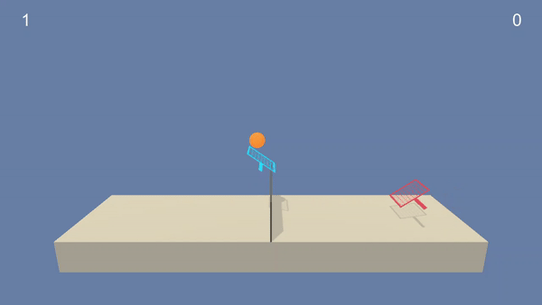

# TennisAI
A multi-agent Reinforcement Learning problem solved using DDPG, training two agents to play tennis.

## Introduction
In this environment, two agents control rackets to bounce a ball over a net. If an agent hits the ball over the net, it receives a reward of **+0.1**. If an agent lets a ball hit the ground or hits the ball out of bounds, it receives a reward of **-0.01**. Thus, the goal of each agent is to keep the ball in play.



The observation space consists of **8** variables corresponding to the position and velocity of the ball and racket. Each agent receives its own, local observation. Two continuous actions are available, corresponding to movement toward (or away from) the net, and jumping.

The task is episodic, and in order to solve the environment, agents must get an average score of **+0.5** (over 100 consecutive episodes, after taking the maximum over both agents). In particular,

* After each episode, we add up the rewards that each agent received (without discounting), to get a score for each agent. This yields 2 (potentially different) scores. We then take the maximum of these 2 scores.
* This yields a single score for each episode.

The environment is considered solved, when the **average (over 100 episodes)** of those scores is at least **+0.5**.

## Getting Started 
1. Prepare new Conda environment

:warning: You may encounter PyTorch installation issues on Windows 10. Looks like required version of PyTorch must be installed using conda: `conda install pytorch=0.4.0 -c pytorch` before running `pip install` in Point 3.


2. Download custom Tennis environment (Unity ML-Agents env)

Linux: [click here](https://s3-us-west-1.amazonaws.com/udacity-drlnd/P3/Tennis/Tennis_Linux.zip)

Mac OSX: [click here](https://s3-us-west-1.amazonaws.com/udacity-drlnd/P3/Tennis/Tennis.app.zip)

Windows (32-bit): [click here](https://s3-us-west-1.amazonaws.com/udacity-drlnd/P3/Tennis/Tennis_Windows_x86.zip)

Windows (64-bit): [click here](https://s3-us-west-1.amazonaws.com/udacity-drlnd/P3/Tennis/Tennis_Windows_x86_64.zip)

The file needs to placed in the root directory of this repository and unzipped.

Path to the executable has to be provided to `UnityEnvironment` function in `TennisAI.ipynb` 

For example on 64-bit Windows:
```python
env = UnityEnvironment(file_name="Tennis_Windows_x86_64/Tennis.exe")
```

3. Run the `TennisAI.ipynb` notebook using the `drlnd` kernel to train the DDPG agent.

Once trained, the model's critic and actor weights will be saved in the same directory in the file `actor.pth` and `critic.pth`.

4. You can see how trained agents move in environment by running `agent_visualisation.ipynb` notebook.

### Dependencies

`Pytorch, Numpy, Matplotlib, unityagents, Jupyter Notebook`
