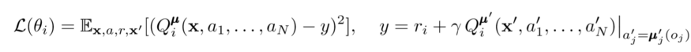
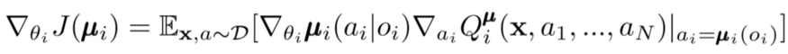
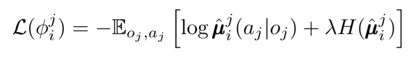
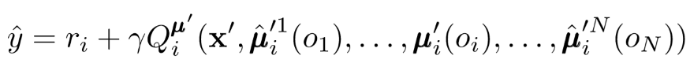
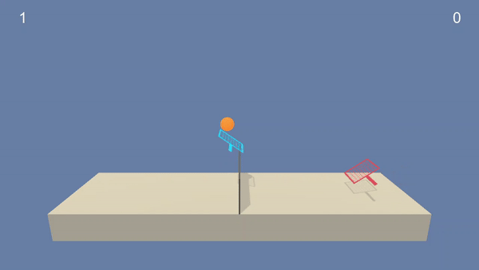
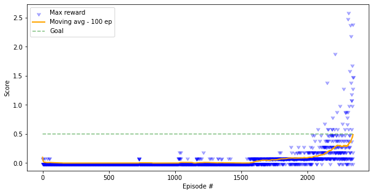

# Reinforcement Learning for Tennis

This project demonstrates the use of the Multi-Agent Deep Deterministic Policy Gradient(DDPG) algorithm to solve a continuous environment. It involves the use of two Neural Networks, one called the Actor network and the other Critic network. The architecture works with the Actor network taking the actions in the given action space and the Critic network evaluating the values of the states/actions. The environment was provided by Unity, wherein the agents have to control a set of two racquets to keep the ball in the air.

## Environment Description

In this environment, two agents control rackets to bounce a ball over a net. If an agent hits the ball over the net, it receives a reward of **+0.1**. If an agent lets a ball hit the ground or hits the ball out of bounds, it receives a reward of **-0.01**. Thus, the goal of each agent is to keep the ball in play.

The observation space consists of **8** variables corresponding to the position and velocity of the ball and racket. Each agent receives its own, local observation. Two continuous actions are available, corresponding to movement toward (or away from) the net, and jumping.

The task is episodic, and in order to solve the environment, agents must get an average score of **+0.5** (over 100 consecutive episodes, after taking the maximum over both agents). In particular,

* After each episode, we add up the rewards that each agent received (without discounting), to get a score for each agent. This yields 2 (potentially different) scores. We then take the maximum of these 2 scores.
* This yields a single score for each episode.

The environment is considered solved, when the **average (over 100 episodes)** of those scores is at least **+0.5**.

## Learning Algorithm

Every agent has an observation space and continuous action space. Also, each agent has three components:
- An actor-network that uses local observations for deterministic actions
- A target actor-network with identical functionality for training stability
- A critic-network that uses joint states action pairs to estimate Q-values

As the critic learns the joint Q-value function over time, it sends appropriate Q-value approximations to the actor to help training. 

### Critic Updates 
To update an agent’s centralized critic, we use a one-step lookahead TD-error

### Actor Updates 
Similar to single-agent DDPG, we use the deterministic policy gradient to update each of the agent’s actor parameters

We can take decentralization one step further. In earlier critic updates, we assumed each agent automatically knew other agents’ actions. However, MADDPG suggests inferring other agents’ policies to make learning even more independent. In effect, each agent adds N-1 more networks to estimate the true policy of each of the other agents. We use a probabilistic network and maximize the log probability of outputting another agent’s observed action

where we show the loss function for the ith agent estimating the jth agent’s policy with an entropy regularizer. As a result, our Q-value target becomes a slightly different value as we replace agent actions with our predicted action

The Agent used following mechanisms:
* Replay buffer of experiences
* Soft targets with specified "softness"
* Discounted rewards
* Noise generation with Ornstein-Uhlenbeck process
* Critic's weights decay
* Delayed updates with specified update period and number of updates per cycle

## Model Architecture

In used Multi-Agent DDPG algorithm two deep neural networks are used and are characterised by following architectures:
- Actor    
    - Hidden 1: (24, 512)   - ReLU
    - Hidden 2: (512, 256)  - ReLU
    - Output: (256, 4)      - TanH

- Critic
    - Hidden 1: (24, 512)   - ReLU
    - Hidden 2: (536, 256)  - ReLU
    - Output: (256, 1)      - Linear

## Hyperparameters

| Hyperparameter                      | Value |
  | ----------------------------------- | ----- |
  | Replay buffer size                  | 1e6|
  | Batch size                          | 512   |
  | gamma (discount factor)             | 0.99  |
  | tau                                 | 0.001 |
  | Learning rate actor                 | 0.0001  |
  | Learning rate critic                | 0.0001   |
  | Update Step                         | 4   |
  | Weight Decay                        | 0  |
  | N Updates                           | 1   |

## Result 

Sample Video of the output

### Reward Plot 

The agents were trained in 2346 episodes!

## Future Work
- Training both the agents separately as they are currently trained on the same neural networks.
- Further Hyperparamter tweaking can also lead to much better performance and/or efficiency.
- Experiment with more Actor-Critic algorithms like D4PG, A2C, AKTR

